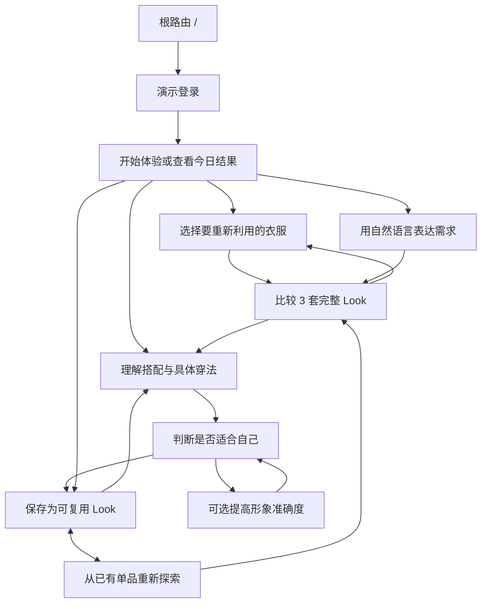
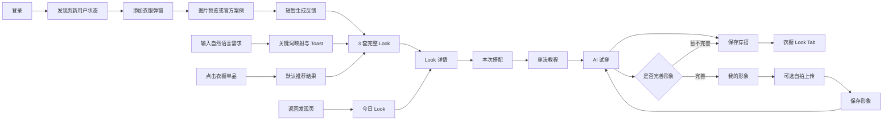

# MUNE 交互设计总结

> 本文基于当前代码仓库的真实实现整理。当前产品是用于 UX 作品集演示的 1.0 桌面 Web Demo，所有体验都位于 Next.js 根路由 `/`，通过前端视图状态切换完成，不包含真实账号、数据库、天气服务或 AI 模型。文中的“已实现”指当前会话内可以点击演示，不代表生产能力已经完成。全文只围绕一个判断展开：用户能否从一件已经拥有的衣服出发，获得更多可执行的完整 Look，并把有效结果沉淀回自己的衣橱。

## 1. 项目与用户问题

MUNE 关注的不是“用户缺少衣服”，而是已经拥有的衣服没有被充分使用。现实中的衣橱往往由大量基础款构成，用户熟悉其中少数固定组合，却很难持续发现新的搭配关系。一件白衬衫可能长期只用于一种通勤穿法；当原有组合失去新鲜感，这件衣服便容易被误认为“不好搭”或“没有衣服可穿”。

用户也能从社交媒体、品牌内容或穿搭教程中看到大量灵感，但这些内容通常建立在别人的衣服、身形和生活场景之上。用户需要自己完成从“这张图很好看”到“我的衣柜里有什么可以替代、应该怎样穿、我穿上会是什么效果”的多次转换，灵感很难直接变成当天可执行的方案。

每天站在衣柜前重新组合天气、场景、已有单品和个人偏好，也会产生持续的决策成本。问题不只是“想不到穿什么”，而是用户必须反复理解衣橱、评估搭配并预想结果。现有虚拟试穿产品更多服务于购买前决策，帮助判断一件新商品是否合适；MUNE 则把试穿放在已有衣物重组之后，用于确认一套完整 Look 是否值得保存和复用。

因此，本项目要验证的核心假设是：如果 AI 能围绕用户已经拥有的一件普通衣服，直接给出少量、完整、可试穿的 Look，并把穿法转译为具体动作，用户可能更容易重新使用现有衣物，而不是继续寻找新商品。该假设目前尚未经过正式用户研究或量化验证，需要设计者后续补充证据。

## 2. 核心体验命题

MUNE 的核心体验命题是：**用一件已有衣服作为最低投入，让用户先获得一套可以执行的结果，再逐步建立更完整的数字衣橱。**

当前体验链路将“一衣多穿”拆成五个连续层级：

1. **一件普通衣服**：用户不需要先整理完整衣柜，只需上传一件已有单品，也可以用白衬衫官方案例快速体验。
2. **多种穿法**：系统不只替换搭配单品，还把半塞、卷袖、自然垂落、叠穿等差异表达为可执行行为。
3. **完整 Look**：推荐页一次提供 3 套人物全身方案，最终交付对象始终是整套穿搭，而不是单件商品或抽象风格词。
4. **自己的试穿结果**：用户可以先使用默认形象预览，也可以在看到价值后补充身形、肤色和自拍信息。
5. **长期 Look 库**：满意的结果被保存到“我的衣橱”的 Look Tab，和已上传单品共同构成可重复使用的个人资产。

这条关系可以概括为：

**已有单品 → 不同穿法与组合 → 完整 Look → 试穿确认 → 保存到个人 Look 库**

当前代码已经完整模拟了这条路径，但 AI 分析、图像生成和数据持久化仍由本地 Mock 和静态图片代替。

## 3. 核心用户任务

| 优先级 | 用户任务 | 设计含义 |
| --- | --- | --- |
| P0 | 今天直接获得一套可穿的 Look | 系统先给出一个可直接采用的结果，避免用户再次进入需要浏览和筛选的大型内容流。 |
| P0 | 围绕某一件已有衣服寻找新穿法 | 用户用一件衣服即可启动推荐，先验证这件衣服还能创造什么价值，而不是被要求补齐完整衣柜。 |
| P1 | 查看自己穿上该 Look 的效果 | 试穿用于回答“这套组合是否适合我”，默认形象让这个判断不依赖前置资料填写。 |
| P1 | 保存并积累自己的穿搭库 | 系统确认保存成功并把结果纳入 Look 库，让一次性的 AI 建议变成之后可以直接复用的个人资产。 |

这四项任务的优先顺序体现了一个取舍：先解决“今天穿什么”和“这件衣服还能怎么穿”，再处理个人精度和长期管理。形象设置、账号设置等低频任务只在提高结果精度时出现，不与“一衣多穿”的首次价值验证竞争注意力。

任务是否应该进入核心流程，只看它能否帮助用户发现、理解、确认或复用已有衣物的新组合。不能直接支持“最大化已有衣橱价值”的能力，不获得同等叙事篇幅。

## 4. 整体信息架构

当前项目只有一个真实 URL 路由 `/`。`login`、`discover`、`recommend`、`detail`、`tryon`、`wardrobe` 和 `profile` 是 React 内部的 `view` 状态，不是独立 URL。作品集中应称其为“体验阶段”或“演示状态”，避免把 Demo 描述成已经完成的生产路由体系。

### 核心价值链

- **发现**首先替用户缩小问题。新用户只需要决定是否用一件衣服开始，老用户只需要判断今日 Look 是否值得继续查看；系统没有要求用户先浏览内容或管理资料。
- **AI 推荐**把同一件已有衣服转化为 3 套完整方案。数量被主动限制，使用户的任务是比较整体穿着结果，而不是继续筛选。
- **Look 详情**回答“这套方案为什么能落到我的衣服上”。本次搭配说明所需单品和处理方式，穿法教程把半塞、卷袖等差异转成动作。
- **AI 试穿**回答“这套方案是否值得我采用”。默认形象先支持判断，个人形象只作为提高准确度的可选投入。
- **我的衣橱**承接结果。保存后的 Look 与已有单品被放在同一个资产语境中，使推荐可以被复用，也可以从单品重新发起。

### 支持核心价值链的捷径

- **添加衣服**在多个场景复用同一流程，因为“换一个起始单品”是重新探索衣橱价值的高频动作。使用浮层而非独立流程，是为了让用户保留当前任务上下文。
- **AI Command Bar**让用户直接表达“想穿哪件衣服、什么天气、什么正式程度”，减少理解系统分类的负担。提交后系统清空输入并进入结果，以行动反馈代替复杂参数确认。

### 被主动弱化的配套能力

- **我的形象**只在用户希望提高试穿可信度时出现，不是首次使用门槛。
- **设置和退出登录**属于账号配套，不直接创造新的衣橱组合，因此只保留低频入口；设置目前仍是占位状态。
- **收藏、选中和 Toast**用于确认当前决定是否生效，不被提升为新的功能层级。

## 5. 核心用户流程

### 5.1 新用户首次体验流程

**用户目标**

用最低成本判断这个产品能否让自己的普通衣服产生新的穿法和搭配。

**用户行为**

提交演示登录表单 → 进入发现页空状态 → 点击“添加第一件衣服” → 在弹窗中选择本地图片或官方白衬衫案例 → 确认上传。

**系统反馈**

系统先用图片预览确认“这就是我要重新搭配的衣服”，避免识别错误后才发现起点不对。确认后以“正在生成...”和 Toast 说明系统已接管任务，再进入 3 套 Look；官方案例跳过上传等待，让没有准备照片的用户也能先判断“一衣多穿”是否有价值。

**下一步操作**

点击一套 Look → 查看搭配和穿法 → 开始试穿 → 保存到衣橱。

### 5.2 老用户今日穿搭流程

**用户目标**

打开产品后快速获得今天可以直接采用的完整穿搭。

**用户行为**

在当前会话中完成过推荐后返回“发现”，或提交过 AI Command Bar 请求。

**系统反馈**

系统不再要求用户从空白开始组合，而是给出一个结合天气与场景的今日结果，让用户只判断“是否采用或继续查看”。

**下一步操作**

用户接受这个方向后进入详情，先确认自己的衣服如何组成该 Look，再决定是否值得试穿和保存。

> 当前限制：老用户状态只由内存中的 `isNewUser` 控制，刷新页面会恢复为登录和新用户状态；没有账号级持久化或真实的“每日更新”机制。

### 5.3 指定单品搭配流程

**用户目标**

围绕某件已有衣服寻找新的完整搭配。

**用户行为**

用户可以在任何需要更换搭配起点的时刻选择另一件已有衣服，也可以从衣橱中直接选择想重新利用的单品。

**系统反馈**

系统把这些意图统一收敛到同一套推荐逻辑，避免用户因入口不同而学习多套流程。当前衣橱单品点击只进入默认推荐，尚未把具体单品身份传递给系统。

**下一步操作**

比较 3 张全身图并选择一套进入详情。

> 当前限制：点击衣橱中的不同单品不会把具体单品身份传入推荐，所有单品都调用同一个默认推荐结果；上传的真实图片也只用于本地预览，没有进入模型分析。

### 5.4 Look 详情与穿法教程流程

**用户目标**

理解这套 Look 由什么构成，以及要通过哪些具体动作穿出图中的比例。

**用户行为**

用户选中一套完整 Look → 先核对自己是否拥有所需单品 → 再查看半塞、卷袖等动作如何形成图中的比例。

**系统反馈**

系统在切换解释方式时保留同一套 Look 上下文，使用户能把“需要什么”与“具体怎么穿”对应起来，而不是进入独立教程后失去参照。收藏动作立即切换状态并显示 Toast，让用户确认这套方案是否已被记录。

**下一步操作**

确认搭配可执行后，用户进入试穿，解决最后一个决策问题：这套方案放到自己身上是否仍然成立。详情阶段没有提供更多并列主操作，避免理解尚未完成就分流。

### 5.5 AI 试穿与保存流程

**用户目标**

降低对搭配结果的不确定感，并把满意的 Look 留作以后直接使用。

**用户行为**

在详情页开始试穿 → 查看静态试穿图 → 选择直接保存，或先进入“我的形象”。

**系统反馈**

未完善形象时显示“完善我的形象，可获得更准确的试穿效果”；完善后文案变为“已使用你的专属形象生成试穿效果”。点击保存后出现“已保存到我的衣橱”Toast，约 450ms 后进入衣橱 Look Tab。

**下一步操作**

在衣橱中重新打开保存的 Look，或继续浏览单品。

> 当前限制：默认形象和完善形象使用同一张静态试穿图；保存只更新当前 React 会话中的 ID 列表，不会持久化到浏览器或服务端。

### 5.6 我的形象编辑流程

**用户目标**

在已经看到产品价值后，补充少量信息以表达对更准确结果的期待。

**用户行为**

点击侧栏底部头像 → 从向上菜单进入“我的形象” → 选择肤色和身型 → 可上传自拍 → 点击保存。

**系统反馈**

系统即时确认肤色和身型选择，并在自拍确认后提示“自拍已上传”，让用户知道提高准确度所需的信息已经被接收。从试穿进入时，保存后返回原任务，避免形象设置变成新的终点；从账号入口进入时则保留编辑上下文。

**下一步操作**

用户回到尚未完成的试穿判断，继续决定是否保存；形象编辑本身不制造新的主任务。

> 当前限制：身高输入框目前是未纳入状态的默认值；代码没有发型单独设置和穿搭偏好控件；肤色、身型和自拍只改变完成状态及界面文案，没有改变推荐或试穿图片。

## 6. 关键交互设计决定

### 6.1 不要求用户先上传完整衣柜

**设计问题：** 完整衣柜初始化需要连续拍摄、分类和校对，用户还没有看到结果就必须投入大量时间。

**原始方案：** 当前仓库没有保留原始实现或 Git 历史；“完整衣柜初始化”只能作为被放弃方向，需要设计者补充早期稿证据。

**发现的问题：** 高前置投入会把产品价值推迟到整理完成之后，也把“试一次”变成一个项目。

**最终决定：** 新用户只上传一件衣服，或直接使用白衬衫官方案例，即可进入 3 套 Look。

**用户收益：** 用户在第一次会话内就能看到“一衣多穿”的结果，再决定是否继续添加衣物。

**设计代价或限制：** 初期衣橱数据很少，推荐多样性和个性化程度有限；需要后续验证“一件衣服”是否足以建立信任。

### 6.2 发现页只保留一个今日 Look

**设计问题：** 如果产品同时提供推荐流、教程、统计和运营内容，用户仍要先浏览、理解和筛选，无法更快回答“今天穿什么”。

**原始方案：** 仓库只保留当前单 Hero 结构，早期多模块版本需要设计者补充。

**发现的问题：** 产品最核心的问题是“今天穿什么”，大量并列内容会模糊这项任务。

**最终决定：** 新用户只被要求用一件衣服启动体验；老用户直接获得一个今日 Look，把系统输出变成“采用或继续了解”的二选一判断。

**用户收益：** 用户不用在多个功能之间选择，产品从内容门户变成替用户缩小选择范围的每日决策工具。

**设计代价或限制：** 单一推荐缺少比较空间，对推荐质量要求更高；当前天气和每日内容均为静态 Mock。

### 6.3 AI 推荐控制为 3 套

**设计问题：** AI 可以生成大量结果，但结果越多，比较和放弃的成本也越高。

**原始方案：** 当前代码没有保留 4 套或无限流版本；数量变化的设计过程需要设计者补充。

**发现的问题：** 用户来到这里是为了缩短穿衣决策，而不是进入另一个需要筛选的内容流。

**最终决定：** 系统一次只给出 3 套完整 Look，弱化名称、标签和附加操作，让用户先比较最终穿着结果。

**用户收益：** 用户可以快速比较轮廓、比例和整体感觉，再选择一套深入理解。

**设计代价或限制：** 3 套是否为最佳数量仍是待验证假设；当前三套结果也是固定 Mock。

### 6.4 强调具体穿法，而不是抽象风格标签

**设计问题：** “极简”“松弛”“法式”等词能够描述气质，却不能告诉用户手里的衬衫具体该怎么处理。

**原始方案：** 推荐数据仍保留场景字段，但推荐概览已经不展示卡片名称或风格标签。

**发现的问题：** 抽象标签可浏览，却难迁移到用户今天的真实动作。

**最终决定：** 推荐页先用图片帮助选择；进入详情后，用“半塞、常规、单肩”和三步教程说明如何实现。

**用户收益：** 结果从灵感图变成可执行步骤，用户更容易照着穿。

**设计代价或限制：** 当前穿法内容对 3 套 Look 共用同一组静态数据，尚未实现逐套差异化解释。

### 6.5 教程放在 Look 详情中

**设计问题：** 独立教程栏目容易把产品变成知识内容库，并中断从结果到试穿的主线。

**原始方案：** 独立教程页没有出现在当前代码中；是否曾经设计过需要设计者补充。

**发现的问题：** 用户只有在认可某套 Look 后，才需要知道这套衣服应该怎样穿。

**最终决定：** 将“需要哪些衣服”和“这些衣服具体怎么穿”保留在同一 Look 上下文中，用户理解完成后才进入试穿。

**用户收益：** 教程拥有明确上下文，用户不需要离开当前 Look 或重新寻找返回路径。

**设计代价或限制：** 小屏或复杂教程可能增加详情页长度；当前仅验证三步静态图文。

### 6.6 默认形象可以直接试穿

**设计问题：** 如果试穿前必须填写身高、身型、肤色并上传自拍，核心价值会被个人资料表单阻断。

**原始方案：** 强制创建形象的版本未保留在仓库中，需要设计者补充早期流程图。

**发现的问题：** 用户尚未看到试穿效果时，很难判断上传身体信息是否值得。

**最终决定：** 默认形象先支持试穿；用户看到结果后再自行决定是否用个人资料换取更高准确度，系统明确“不上传也可以继续使用”。

**用户收益：** 用户先完成核心任务，在理解收益后再自愿增加投入。

**设计代价或限制：** 默认形象可能与本人差异较大；当前 Demo 还没有真正生成不同形象结果。

### 6.7 我的形象放在头像菜单

**设计问题：** 形象和账号设置有助于提高精度或维护账号，却不会直接帮助用户发现一件衣服的新穿法。

**原始方案：** 当前仓库没有保留“我的”一级导航版本；只能从最终两项主导航反推这一收敛。

**发现的问题：** 把低频设置放入主导航会让“发现”和“衣橱”的任务边界变弱。

**最终决定：** 核心任务只保留“获得穿搭”和“复用衣橱”；形象、设置和退出只有在用户主动处理账号或精度问题时才出现。

**用户收益：** 用户优先看到“找穿搭”和“复用衣橱”两项核心任务，需要提高精度时仍能找到个人设置。

**设计代价或限制：** 头像入口的可发现性低于一级导航；“设置”目前还是无交互占位项。

### 6.8 Look 和单品合并在“我的衣橱”

**设计问题：** 单品和完整 Look 都是用户资产，但拆成两个一级栏目会增加导航层级和概念判断。

**原始方案：** 独立 Look 模块没有出现在当前代码中；需要设计者用早期稿补充演变过程。

**发现的问题：** 用户更需要在“我已经有什么”这个共同语境下切换，而不是维护两套信息架构。

**最终决定：** 将 Look 和单品归入同一个“已有资产”概念：Look 负责复用结果，单品负责重新发起一衣多穿。

**用户收益：** 用户可以从完整结果回看，也可以从已有单品重新发起搭配，不必离开衣橱语境。

**设计代价或限制：** 两类对象的管理需求不同，未来增加编辑、筛选和状态时可能需要更明确的子结构。

### 6.9 添加衣服使用全局入口和弹窗

**设计问题：** 新用户开始体验、老用户更换起始单品和日常扩充衣橱，本质上都是“选择下一件要重新利用的衣服”。

**原始方案：** 独立上传页面未保留在当前代码中，需要设计者补充历史版本。

**发现的问题：** 把上传做成独立页面会打断用户所在上下文，并增加返回和导航判断。

**最终决定：** 多个场景复用同一添加流程，系统收到单品后统一进入 3 套 Look，避免入口不同导致结果逻辑分裂。

**用户收益：** 用户可以在当前决策中更换起始单品，不必先退出流程或重新理解下一步。

**设计代价或限制：** 复杂的批量上传、编辑和分类不适合弹窗；当前“拖拽上传”只有文案，尚未实现拖放事件。

### 6.10 减少筛选标签，强化自然语言输入

**设计问题：** 天气、场景、风格、颜色和单品类型如果全部变成筛选器，用户必须先理解系统分类。

**原始方案：** 当前代码未保留复杂筛选界面；这一取舍由无筛选结构和 Command Bar 共同支持。

**发现的问题：** 用户的穿衣需求通常以一句话出现，例如“今天下雨怎么穿”或“想穿白衬衫”。

**最终决定：** 用户可以直接用自然语言描述需求；系统用示例短语说明能力边界，接收请求后直接给出 3 套结果。

**用户收益：** 用户可以用自己的语言表达意图，不必把需求拆解成多个筛选条件。

**设计代价或限制：** 自然语言需要可靠的理解和可解释反馈；当前实现只判断是否包含“白衬衫”，其他输入统一映射到同一套 Mock 结果。

## 7. 页面之间的交互关系

当前设计不是为了覆盖更多页面，而是让同一件衣服在不同阶段补充恰好足够的信息，逐步降低用户对结果的不确定性。最大化已有衣橱价值并不只发生在推荐时，而是由下面这条信息传递链共同完成：

1. **上传确定要重新利用的对象。** 用户先确认“这次要围绕哪件衣服搭配”，系统再开始组合，避免推荐与真实衣橱脱节。当前真实图片只形成本地预览，官方案例和上传确认最终都进入相同的推荐 Mock。
2. **推荐把开放问题缩小为 3 个可比较结果。** 用户不必先理解风格分类，只需判断哪套完整穿着更接近今天的需要。被选择的 `Look` 写入 `selectedLook`，成为后续解释和试穿的共同上下文。
3. **详情把灵感转成可执行行为。** “本次搭配”回答需要哪些已有单品，“穿法教程”说明半塞、垂落和卷袖如何形成比例。用户理解怎么实现后，才需要判断自己穿上的效果。
4. **试穿处理最后的不确定性。** 系统不要求用户编辑大量参数，只让用户判断这套方案是否值得保存，以及是否值得投入更多个人信息提高准确度。
5. **保存把一次建议变成长期资产。** 系统确认保存成功，并把当前 Look 纳入可再次查看的集合，避免用户下一次又从零开始搭配。
6. **衣橱形成循环，而不是终点。** 已保存 Look 用于直接复用，已有单品用于再次探索新的穿法。当前单品身份尚未真正传递，因此重新搭配仍只是流程演示。
7. **我的形象只服务于结果可信度。** 用户从试穿进入形象编辑后会返回原判断，`profileComplete` 改变系统反馈，而不会把形象设置变成独立主任务。身型、肤色和自拍尚未改变实际推荐图片。
8. **AI Command Bar 让用户绕过分类。** 用户可以随时用自然语言重新描述衣服、天气或场景；系统清空已提交内容并进入结果，减少返回起点和配置筛选器的成本。

这套关系体现了“结果 → 理解 → 预览 → 保存”的递进顺序。每一步只解决当前不确定性，不在最前面一次性暴露所有能力。

## 8. 状态与系统反馈

### 已实现

| 状态 | 用户决策与系统反馈 | 代码依据 |
| --- | --- | --- |
| 新用户 / 会话内老用户 | 新用户只需决定是否用一件衣服开始；完成体验后，系统改为直接给出今日 Look，减少重复引导。 | `Discover` |
| 选择搭配起点 | 用户可以上传自己的衣服，也可以先用官方案例验证价值；两种方式都回答“先拿哪件衣服开始”。 | `UploadModal` |
| 上传选择完成 | 系统立即回显图片，让用户在生成前确认对象正确，避免基于错误单品继续投入。 | `uploadPreview` |
| 短暂生成中 | “正在生成...”和 Toast 表明系统已接管组合任务；当前只使用短反馈，没有增加进度配置。 | `uploading`、`confirmUpload` |
| 推荐结果 | 系统把开放选择压缩为 3 套完整 Look，用户只需比较哪套结果更适合今天。 | `looks`、`Recommend` |
| 当前 Look | 用户的选择被写入统一上下文，后续搭配解释、教程和试穿都围绕同一结果，避免信息错位。 | `openDetail` |
| 搭配与穿法切换 | 用户可先确认自己是否拥有所需单品，再理解具体动作；系统保留同一 Look，避免独立教程造成上下文丢失。 | `detailTab` |
| Look 与单品切换 | 用户在“复用已有结果”和“重新探索已有衣服”之间切换，两类资产不需要成为两套独立产品。 | `wardrobeTab` |
| 收藏状态 | 系统用状态变化和 Toast 确认用户是否暂时记录了这套方案，不要求进入额外管理流程。 | `favoriteLookIds` |
| 保存成功 | 系统确认结果已沉淀，并把用户带到可复用的 Look 集合，完成从推荐到个人资产的闭环。 | `saveLook` |
| 形象选中 | 系统即时确认肤色和身型选择，让用户知道哪些信息将用于提高准确度；不要求填写复杂身体参数。 | `skinTone`、`bodyType` |
| 默认 / 完整形象 | 用户可以不提供资料先试穿；看到价值后完善形象，系统再提示精度预期已经变化。 | `TryOn` |
| 自拍上传 | 选择后先预览，确认后再提示完成，降低误传照片的风险；自拍仍是可选投入。 | `ProfilePhotoModal` |
| AI 输入聚焦 | 示例短语帮助用户理解可以怎样表达需求，但不迫使用户学习天气、风格和单品分类。 | `promptOpen` |
| AI 输入提交 | 提交后系统清空输入并进入推荐，确认请求已被接收；空输入不会触发无意义生成。 | `handlePromptSubmit` |
| 演示登录 | 只负责让作品集演示进入核心任务，不承担衣橱决策；提交后直接开始判断如何利用已有衣物。 | `handleLogin` |
| 低频账号操作 | 个人形象、设置和退出被收纳在低频入口中，避免与“一衣多穿”的主任务并列。 | `menuOpen` |
| 基础操作反馈 | Hover、Active 和 Focus 帮助用户确认当前可操作对象和选中结果，不增加额外解释步骤。 | `globals.css` |

### 部分实现

| 状态 | 当前支持的判断 | 为什么仍不完整 |
| --- | --- | --- |
| 老用户状态 | 用户完成一次价值体验后，不再重复接受新用户解释，而是直接判断今日 Look | 刷新后不保留；没有账号、日期或真实历史判断 |
| AI 生成中 | 用户知道系统已经开始处理，不会误以为确认失败 | 没有进度、取消、超时或重试；控制项未禁用，无法处理真实等待 |
| 自然语言理解 | 用户可以用一句话进入推荐，并看到白衬衫关键词产生不同分支 | 没有真实语义理解、天气解析或多条件组合 |
| 衣橱空状态 | 新用户能理解必须先提供一件已有衣服 | 衣橱数据始终为预置 Mock，无法真实反映渐进式建库 |
| 保存 Look | 用户收到保存确认并进入结果集合 | 集合数量和图片仍为固定素材；刷新后丢失，无法证明长期价值 |
| 单品重新搭配 | 用户能从已有衣服重新启动“一衣多穿”流程 | 没有传入具体单品，所有单品进入相同默认结果 |
| 完善形象 | 用户可以表达肤色、身型和自拍投入，并返回原试穿任务 | 身高未保存；形象信息不影响图片；发型只存在于说明文案 |
| 低频菜单关闭 | 用户可以进入形象或退出当前会话 | 点击外部不会关闭；设置项没有目标，但这些问题不影响核心 Demo 主线 |
| 上传完成 | 用户能确认衣服图片并进入推荐 | 没有服务端上传，成功后预览也未主动清空 |
| 可访问性 | 用户可以通过部分语义属性和焦点反馈识别状态 | 浮层无焦点陷阱与 Escape 关闭，键盘流程尚未完整验证 |

### 尚未实现

- 真实登录、注册、忘记密码和会话鉴权；密码显示按钮目前没有切换逻辑。
- 真实文件上传、图片检测、抠图、服装识别和衣物分类。
- 拖拽上传事件，尽管界面文案写有“点击或拖拽”。
- 真实 AI 推荐、天气数据、场景推理、用户偏好推理和图像生成。
- 上传失败、格式错误、图片过大、网络错误、模型失败、生成超时、保存失败等错误反馈。
- 推荐结果为空、部分结果失败、重新生成和取消生成。
- 账号级衣橱、收藏、形象信息和历史记录持久化。
- 明确的穿搭偏好编辑；当前 Profile 没有相关控件。
- “设置”页面或弹窗。
- 不同 Look 对应不同详情图、试穿图、单品组合和教程内容。
- 真实的每日 Look 更新和返回用户识别。
- 对自拍的隐私说明、授权、删除和数据处理反馈。

## 9. 交互简化与迭代

当前仓库没有 Git 提交历史，也没有保留早期页面代码，因此以下内容是由最终结构和 README 反向推断出的设计收敛，不应写成已经被用户测试证明的结论。所有简化都使用同一个判断标准：是否让“一衣多穿”更快产生可执行结果，是否让结果更容易沉淀并继续扩大已有衣橱的使用价值。

| 可确认的简化 | 当前代码中的证据 | 作品集表达建议 |
| --- | --- | --- |
| 从完整衣柜初始化收敛到一件衣服即可体验 | 新用户 CTA、单图上传、白衬衫官方案例 | 强调“先展示价值，再要求投入”；早期完整衣柜方案需要设计者补充。 |
| 从泛化穿搭功能聚焦到“一衣多穿 → 完整 Look” | 3 套 Look、搭配列表、三步穿法教程 | 说明最终交付是完整 Look，穿法是帮助执行结果的手段。 |
| 从多个一级栏目收敛为发现和我的衣橱 | 核心任务只剩“获得结果”和“复用已有资产” | 把低频形象和设置移出主任务，减少用户判断下一步的成本。 |
| 从独立 Look 管理收敛为衣橱双 Tab | `Wardrobe` 让 Look 回到详情、让单品回到推荐 | 用“结果复用 / 单品再探索”解释两类资产，而不是维护两个产品模块。 |
| 从独立上传页面收敛为全局添加流程 | 新用户 CTA、重新选择和全局操作共用 `UploadModal` | 用户无论从哪里更换起始单品，都获得相同反馈和结果路径。 |
| 从大量推荐信息收敛为 3 个完整结果 | `Recommend` 不提供标签、筛选或并列操作 | 先完成整体结果比较，解释延后到用户已经选中的 Look。 |
| 从抽象风格标签收敛到具体穿法 | `OutfitList` 的穿法字段和 `TutorialList` | 用行为指导替代只可描述、不可执行的标签。 |
| 从独立教程收敛为选中 Look 的局部解释 | `detailTab` 保留同一个 `selectedLook` | 教程只在用户认可某套 Look 后出现，所有动作都有明确参照。 |
| 从复杂筛选收敛为自然语言入口 | 全局 `Header` 和两条建议短语 | 让 AI 承担分类理解；当前语义能力仍是 Mock。 |
| 从强制创建形象收敛为默认形象先体验 | `profileComplete` 默认 `false` 仍可进入试穿 | 把个人资料投入延迟到用户看到结果之后。 |
| 从多个并列操作收敛为单一下一步 | 各阶段只推进一个核心判断 | 系统一次只问用户一个问题，其他能力在需要时再出现。 |

### 需要设计者补充

- 早期完整衣柜、独立上传页、独立教程页或更多主导航的线框图，证明迭代前后的变化。
- 为什么最终选择 3 套而不是 2 套或 4 套的判断依据。
- 收藏 Look 与保存穿搭的概念差异，以及未来是否需要合并。
- 目标用户的具体生活场景、衣橱规模和对自拍隐私的态度。
- 对“一件衣服即可建立价值感”“自然语言比筛选更低成本”等假设的后续验证方法。

## 10. 作品集叙事版本

### 背景

MUNE 是一款用于 UX 作品集演示的 1.0 桌面 Web Demo。项目关注已有衣橱的再利用，而不是帮助用户继续购物。当前版本优先验证从上传一件衣服、获得完整 Look、理解穿法、试穿到保存的体验闭环，数据和 AI 结果均由前端 Mock 支撑。

### 问题

用户衣柜里已经有足够多的衣服，却常年依赖少数固定组合。外部穿搭灵感很难直接迁移到自己的单品和身形，每天重新判断天气、场景和搭配比例也会形成决策负担。传统虚拟试穿更多服务购买前决策，没有帮助用户重新理解已有衣物。

### 洞察

项目的待验证洞察是：用户不一定需要更多推荐内容，而需要更短的“从已有单品到可执行结果”路径。与其先整理完整衣柜，不如让用户上传一件普通衣服，立即看到它通过不同穿法形成的 3 套完整 Look，再决定是否继续投入个人信息。

### 设计目标

设计目标不是建立功能最完整的衣橱工具，而是让用户在第一次会话中完成一个有结果的任务：找到一套穿搭、知道具体怎样穿、查看试穿效果并保存。每一步只增加完成下一步所需的信息，避免在用户尚未看到价值时要求分类、筛选和身体资料。

### 核心策略

体验采用“先结果、后投入”和“渐进式建库”两条策略。发现页只保留一个主任务，推荐限制为 3 套，穿法解释延后到 Look 详情，默认形象允许直接试穿。用户在上传、试穿和保存的过程中自然积累单品与 Look，而不是一次性完成衣橱初始化。

### 关键流程

新用户只需用一件衣服或官方案例启动体验，系统便把开放的搭配问题压缩为 3 套完整 Look。用户先确认所需单品和具体穿法，再用默认形象判断结果是否适合自己。满意后保存为可复用资产；只有需要更高准确度时，才补充个人形象。

### 重要设计决定

产品只强调“获得穿搭”和“复用衣橱”两项核心任务。添加衣服服务于重新选择搭配起点，形象设置只在提高精度时出现。Look 与单品被理解为同一衣橱资产的两种用途，复杂筛选则由自然语言替代，让 AI 承担分类和解释成本。

### 最终方案

当前方案形成了“已有单品 → 3 套 Look → 搭配与穿法 → AI 试穿 → 保存到衣橱”的完整可点击链路。用户先通过整体结果选择方向，再通过具体穿法确认可执行性，最后用试穿和保存完成决策。每个阶段只提出一个新问题，让“最大化已有衣橱价值”从口号转化为可以连续完成的行为。

### 当前限制

当前版本没有真实登录、数据持久化、天气服务和 AI 模型。自然语言只做关键词映射，上传图片只用于本地预览，形象信息不会改变试穿图。新用户空状态与预置衣橱数据也未完全同步。这些限制需要在作品集中明确，避免把原型描述为成熟产品。

### 下一步计划

下一步应先验证关键假设，而不是继续增加功能：用户是否理解“一衣多穿”、3 套是否足以决策、穿法指导是否能真正帮助照着穿、默认形象是否足以支持首次判断。验证后再接入真实单品识别、天气和生成模型，并补充失败、隐私和持久化状态。

## 11. 代码与设计对应表

下表优先记录能够证明“一衣多穿”核心判断的状态。登录、账号菜单等配套能力只保留最低必要信息，不建议在作品集中与核心流程获得同等视觉篇幅。

| 交互设计内容 | 对应页面或路由 | 主要组件 | 当前状态 | 作品集截图建议 |
| --- | --- | --- | --- | --- |
| 用一件衣服开始验证价值 | `/`，`view="discover"`，`isNewUser=true` | `Discover` | 用户不必初始化完整衣柜，只需决定是否用一件衣服开始 | 截取“只投入一件衣服即可获得结果”的决策时刻 |
| 确认要重新搭配的单品 | 工作区全局状态 | `Sidebar`、`UploadModal` | 支持图片预览和官方案例；真实识别尚未实现 | 截取图片已预览、系统等待用户确认搭配起点的状态 |
| 把开放问题压缩为 3 套 Look | `/`，`view="recommend"` | `Recommend` | 3 套固定 Mock 可进入详情，不提供复杂筛选 | 截取用户只需比较 3 个完整结果的状态 |
| 确认 Look 是否能由现有衣物完成 | `/`，`view="detail"`，`detailTab="outfit"` | `LookDetail`、`OutfitList` | 已说明单品和穿法；内容尚未按不同 Look 变化 | 截取用户核对“我有什么、应该怎么处理”的状态 |
| 把穿搭灵感转成具体动作 | `/`，`view="detail"`，`detailTab="tutorial"` | `LookDetail`、`TutorialList` | 已实现三步静态教程 | 截取半塞、垂落、卷袖如何对应同一 Look |
| 用默认形象先判断结果 | `/`，`view="tryon"`，`profileComplete=false` | `TryOn` | 用户无需资料即可试穿；图片为静态 Mock | 截取“先体验还是先完善资料”的可选决策 |
| 把满意结果沉淀为资产 | 试穿 → `view="wardrobe"`，`wardrobeTab="looks"` | `saveLook`、`Wardrobe` | 会话内保存、Toast 和跳转已实现；刷新后丢失 | 连续截取保存确认与结果进入 Look 库 |
| 从结果复用或从单品重新探索 | `/`，`view="wardrobe"` | `Wardrobe` | Look 可回到详情；单品可重新推荐，但未传递具体身份 | 对照截取“直接复用 Look”和“重新利用单品”两种任务 |
| 老用户直接获得今日方案 | `/`，`view="discover"`，`isNewUser=false` | `Discover` | 会话内已实现；没有真实每日更新 | 截取系统已经替用户缩小选择范围的今日结果 |
| 用自然语言替代复杂筛选 | 所有工作区状态 | `Header` | 短语和 Enter 已实现；语义仅为关键词 Mock | 截取用户表达需求后直接进入结果的前后状态 |
| 看到价值后再完善形象 | `/`，`view="profile"` 及自拍状态 | `Profile`、`ProfilePhotoModal` | 选择和反馈可演示；尚未影响生成结果 | 截取从试穿进入形象、保存后返回试穿的连续关系 |
| 配套账号操作 | `/`，`view="login"` 及 `menuOpen=true` | `Home`、`Sidebar` | 登录为 Mock；设置无行为 | 仅在流程总览中简要出现，不作为核心案例大图 |
| 错误与恢复 | 尚无对应状态 | 无 | 尚未实现 | 作为下一步设计缺口说明，不伪造现有截图 |
